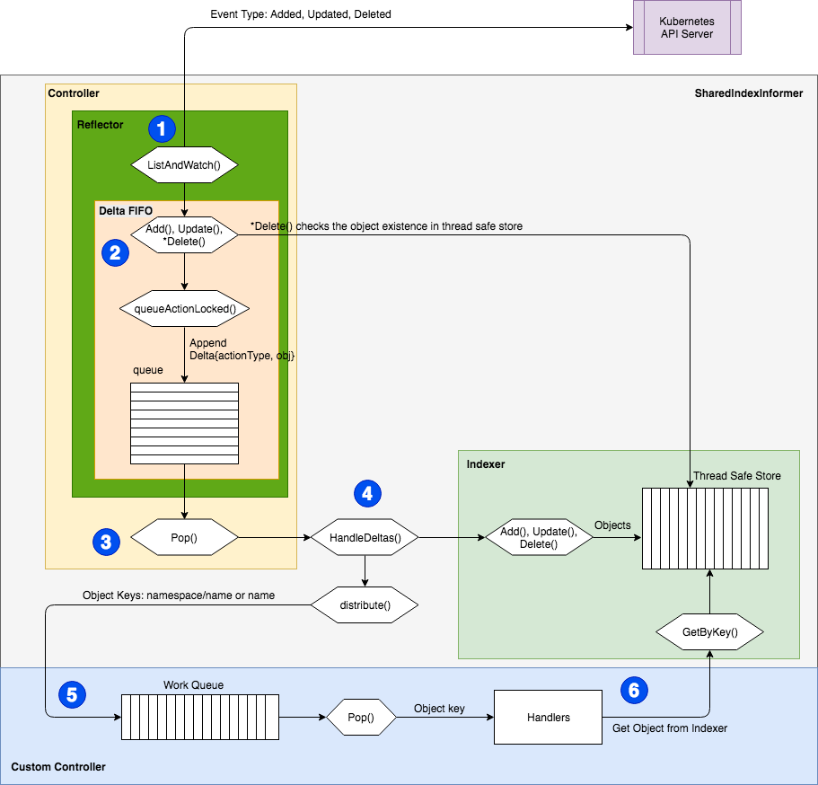
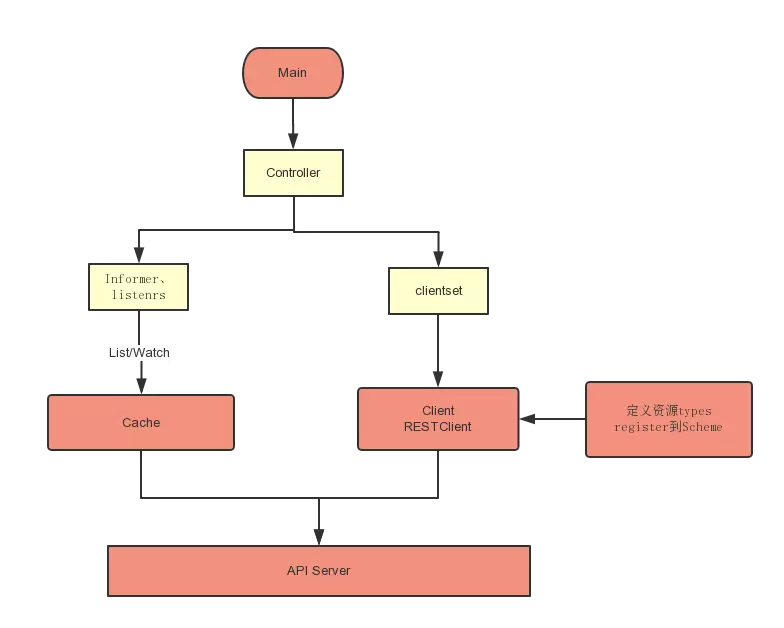

# Kubernetes client-go 库介绍和源码解析

client-go 项目地址：https://github.com/kubernetes/client-go

本文档源码分析基于 kubernetes-1.13.5-beta.0 版本。

## 基本介绍

Kubernetes 官方从 2016 年 8 月份开始，将 Kubernetes 资源操作相关的核心源码抽取出来，独立出来一个项目 `client-go`，作为官方提供的 Go client。

Kubernetes 的部分代码也是基于这个 client 实现的，所以对这个 client 的质量、性能等方面还是非常有信心的。

client-go 是一个调用 kubernetes 集群资源对象 API 的客户端，即通过 client-go 实现对 kubernetes 集群中资源对象（包括 deployment、service、ingress、replicaSet、pod、namespace、node 等）的增删改查等操作。

## 源码简介

主要目录功能说明：

+ discovery：通过 Kubernetes API 进行服务发现；
+ dynamic：对任意 Kubernetes 对象执行通用操作的动态 client；
+ informers：Kubernetes 内置对象的 Informer 定义，
+ kubernetes： 访问 Kubernetes API 的一系列的 clientset；
+ rest：访问 Kubernetes API 的 Rest 库，是 dynamic 和 clientset 的基础；
+ transport：启动连接和鉴权 auth；
+ tools/cache：controllers 控制器；

## Client 类型

1. RESTClient：RESTClient 是最基础的，相当于的底层基础结构，可以直接通过 RESTClient 提供的 RESTful 方法如 Get()，Put()，Post()，Delete() 进行交互
    + 同时支持 Json 和 protobuf
    + 支持所有原生资源和 CRDs
    + 但是，一般而言，为了更为优雅的处理，需要进一步封装，通过 clientset 封装 RESTClient，然后再对外提供接口和服务;

2. Clientset：Clientset 是调用 Kubernetes 资源对象最常用的 client，可以操作所有的资源对象，它是基于 RESTClient 实现的。
    + 访问资源时，需要指定它的 Group、Version、Resource；
    + 优雅的姿势是利用一个 controller 对象，再加上 Informer；

3. DynamicClient：DynamicClient 是一种动态的 client，它能处理 kubernetes 所有的资源。不同于 Clientset，DynamicClient 返回的对象是一个 `map[string]interface{}`。
    + 如果一个 controller 中需要控制所有的 API，可以使用 DynamicClient，目前它在 garbage collector 和 namespace controller 中被使用。
    + 只支持 JSON

## Informer

Informer 是 client-go 中较为高级的类型。无论是 Kubernetes 内置的还是自己实现的 Controller，都会用到它。

Informer 设计为 List/Watch 的方式。Informer 在初始化的时先通过 List 从 Kubernetes 中取出资源的全部对象，并同时缓存，然后后面通过 Watch 的机制去监控资源，这样的话，通过 Informer 及其缓存，我们就可以直接和 Informer 交互而不是每次都和 Kubernetes 交互。

Informer 另外一块内容在于提供了事件 Handler 机制，并会触发回调，这样上层应用如 Controller 就可以基于回调处理具体业务逻辑。

因为Informer 通过 List、Watch 机制可以监控到所有资源的所有事件，因此只要给 Informer 添加 ResourceEventHandler 实例的回调函数实例取实现 OnAdd(obj interface{}) OnUpdate(oldObj, newObj interface{}) 和 OnDelete(obj interface{})这三个方法，就可以处理好资源的创建、更新和删除操作。

## 对象资源的操作接口

默认的每一种资源对象都有一个 Interface，封装了对象的 CURD 方法和 List/Watch方法。

如 Deployment(k8s.io/client-go/kubernetes/typed/apps/v1/deployment.go)：

``` go
type DeploymentInterface interface {
    Create(*v1.Deployment) (*v1.Deployment, error)
    Update(*v1.Deployment) (*v1.Deployment, error)
    UpdateStatus(*v1.Deployment) (*v1.Deployment, error)
    Delete(name string, options *metav1.DeleteOptions) error
    DeleteCollection(options *metav1.DeleteOptions, listOptions metav1.ListOptions) error
    Get(name string, options metav1.GetOptions) (*v1.Deployment, error)
    List(opts metav1.ListOptions) (*v1.DeploymentList, error)
    Watch(opts metav1.ListOptions) (watch.Interface, error)
    Patch(name string, pt types.PatchType, data []byte, subresources ...string) (result *v1.Deployment, err error)
    DeploymentExpansion
}
```

如 Service(k8s.io/client-go/kubernetes/typed/core/v1/service.go)：

``` go
// ServiceInterface has methods to work with Service resources.
type ServiceInterface interface {
    Create(*v1.Service) (*v1.Service, error)
    Update(*v1.Service) (*v1.Service, error)
    UpdateStatus(*v1.Service) (*v1.Service, error)
    Delete(name string, options *metav1.DeleteOptions) error
    Get(name string, options metav1.GetOptions) (*v1.Service, error)
    List(opts metav1.ListOptions) (*v1.ServiceList, error)
    Watch(opts metav1.ListOptions) (watch.Interface, error)
    Patch(name string, pt types.PatchType, data []byte, subresources ...string) (result *v1.Service, err error)
    ServiceExpansion
}
```

通过这种 Interface 定义，Kubernetes 中所有对象资源的操作方式都是统一的。

## client-go 的设计思想

client-go/tool/cache/ 和自定义 Controller 的控制流（[来源](https://itnext.io/how-to-create-a-kubernetes-custom-controller-using-client-go-f36a7a7536cc)）：



上图相对较为复杂，有很多细节，我自己结合源码的理解如下：



## client-go 组件

+ Reflector：通过 Kubernetes API 监控 Kubernetes 的资源类型
    采用List、Watch机制
    可以Watch任何资源包括CRD
    添加object对象到FIFO队列，然后Informer会从队列里面取数据

+ Informer：controller机制的基础
    循环处理object对象
    从Reflector取出数据，然后将数据给到Indexer去缓存
    提供对象事件的handler接口

+ Indexer：提供object对象的索引，是线程安全的，缓存对象信息

## controller 组件

+ Informer reference: controller需要创建合适的Informer才能通过Informer reference操作资源对象
+ Indexer reference: controller创建Indexer reference然后去利用索引做相关处理
+ Resource Event Handlers：Informer会回调这些handlers
+ Work queue: Resource Event Handlers被回调后将key写到工作队列
    这里的key相当于事件通知，后面根据取出事件后，做后续的处理
+ Process Item：从工作队列中取出key后进行后续处理，具体处理可以通过Indexer reference
    controller可以直接创建上述两个引用对象去处理，也可以采用工厂模式，官方都有相关示例

## 参考
1. [Kubernetes的client-go库介绍](https://www.jianshu.com/p/d17f70369c35)
2. [client-go under the hood](https://github.com/kubernetes/sample-controller/blob/master/docs/controller-client-go.md)
3. [sample-controller](https://github.com/kubernetes/sample-controller)
4. [kubebuilder 文档](https://book.kubebuilder.io/)
5. [deployment_controller](https://github.com/kubernetes/kubernetes/blob/master/pkg/controller/deployment/deployment_controller.go)
6. [Writing Controllers](https://github.com/kubernetes/community/blob/master/contributors/devel/controllers.md)
7. [controller-runtime 实例](https://github.com/googlecloudrobotics/core/blob/master/src/go/pkg/controller/chartassignment/controller.go)
8. [etcd-operator](https://github.com/coreos/etcd-operator)