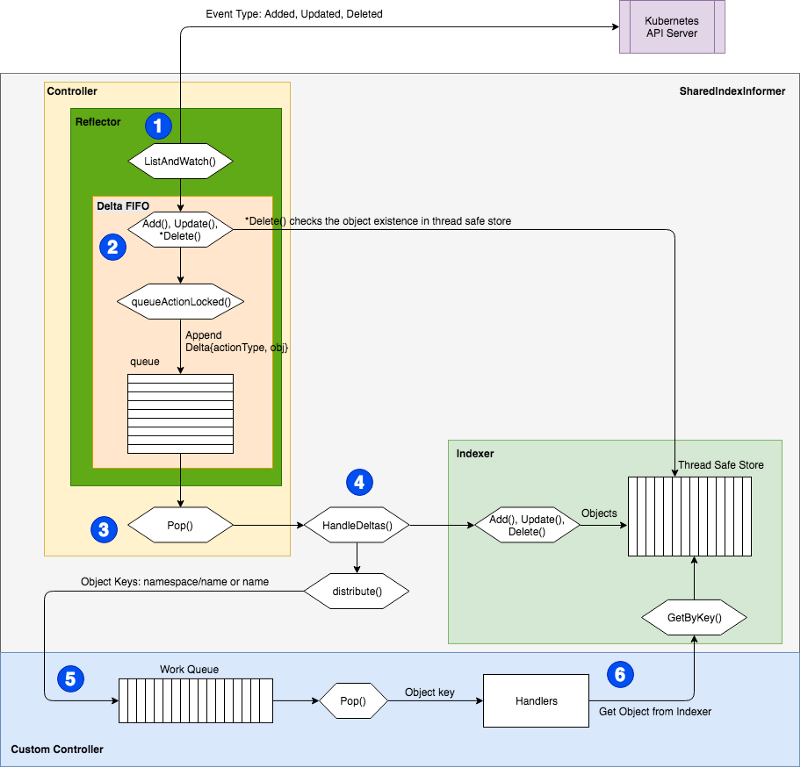

来源：https://itnext.io/how-to-create-a-kubernetes-custom-controller-using-client-go-f36a7a7536cc

With Kubernetes custom controller, you can further develop your own custom business logic by watching events from Kubernetes API objects such as namespace, deployment or pod, or your own CRD (custom resource definitions) resource.

The next part of the article will provide a deep dive on the client-go module, following by a custom controller example.

## client-go module

client-go is being used by Kubernetes as the offical API client library, providing access to Kubernetes` restful API interface served by the Kubernetes API server. Tools like kubectl or prometheus-operator use it intensively.

The library contains several important packages and utilities which can be used for accessing the API resources or facilitate a custom controller.

+ `kubernetes` package provides clientset and Kubernetes resource specific clientset methods for accessing standard Kubernetes APIs. Note you should not use it for accessing CRD resources. This package is auto generated.

+ `discovery` package provides ways to discover server-supported API groups, versions and resources.

+ `dynamic` package provides a dynamic client which can perform restful operations on arbitrary Kubernetes API resources [1]. Note that it’s discouraged to use it for access CRD resource due to it’s not type-safe [2].

+ `transport` package setups the secure TCP authorisation and connection. The default will be using HTTP2 protocol if not explicitly disabled. The underlying HTTP2 facility is provided by k8s.io/apimachinery/util/net. Due to some of the operations requires transfer of binary streams between the client and a container, such as attach, exec, portforward and logging, the transport package also establishes streaming channels. It employed SPDY and WebSocket protocols before HTTP2 became available.

+ `plugin` package provides authorisation plugins for cloud providers such as Openstack, GCP and Azure.

+ `scale` package provides a polymorphic scale client capable of fetching and updating Scale for any resource which implements the “scale” subresource, as long as that subresource operates on aversion of scale convertable to autoscaling.Scale. Note prior to Kubernetes v1.10, it doesn’t support scaling CRD[2].

+ `util` package provides convenient utilities such as work queue, buffer.

+ `tool/cache` package has many useful facilities such as SharedInformer, reflector, stores and indexers. It provides a client-side query and caching mechanism, reducing the number of request to the server and keep tracking of the events. I will be detailing workflow provided by utilities in this package because it does the plumbing when writing a custom controllers.



As shown in the above graph, there are two main parts of actions. One happens in SharedIndexInformer, the other one is in custom controller.

1. Reflector performs object (such as namespace, pod etc) ListAndWatch queries to the Kubernetes API server. Three event types Added, Updated and Deleted are being recorded along with the related objects. They are then passed onto DeltaFIFO. Note only events occurred within the past five minutes can be retrieved by default.

   A given Kubernetes server will only preserve a historical list of changes for a limited time. Clusters using etcd3 preserve changes in the last 5 minutes by default. When the requested watch operations fail because the historical version of that resource is not available, clients must handle the case by recognizing the status code 410 Gone, clearing their local cache, performing a list operation, and starting the watch from the resourceVersion returned by that new list operation. Most client libraries offer some form of standard tool for this logic. (In Go this is called a Reflector and is located in the k8s.io/client-go/cache package.)[3]

2. DeltaFIFO ingests the events and the objects correspondingly to the watch events, then translates them into Delta object. Those Delta objects get appended into a queue waiting for processing. For Deleted, it will check if it’s already existed in the thread safe store so it can avoid queuing up a delete action while something doesn’t exist.

3. Cache controller (Not to confused with custom controller) calls Pop() method to dequeue the DeltaFIFO queue. The Delta objects get passed onto SharedIndexInformer’s HandleDelta() method for further processing.

4. According to the Delta object’s action (event) type, the objects firstly get saved into thread safe store via indexer’s method in HandleDeltas method. It then sends those objects via sharedProcessor’s distribute() method in SharedIndexInformer to event handlers which have been registered by the custom controller through SharedInformer’s methods such as AddEventHandlerWithResyncPeriod().

5. The registered event handlers convert the object into key strings in a format of “namespace/name” or just “name” if no namespace through MetaNamespaceKeyFunc() for add and update events, DeletionHandlingMetaNamespaceKeyFunc() for delete event. The keys then get added into custom controller’s workqueue. The type of workqueues could be found in util/workqueue.

6. The custom controller pops keys from the workqueue for processing by calling custom handlers. The custom handlers will invoke indexer’s GetByKey() to retrieve the object from thread safe store. The custom handlers are where your business logic lives.

## Example of a simple custom controller using workqueue

Below is an example of custom controller that watches pods in default namespace. The workqueue type is RateLimitQueue. The controller spawns out one worker in below example. You can change the number of workers when calling controller.Run().

Note that below example is using an IndexInformer which can only have one sets of the handlers to subscribe to the events. The recommendation is to use SharedIndexInformer instead. The difference is ShareIndexInformer provides methods like AddEventHandlerWithResyncPeriod() to allow you adding multiple set of handlers, consequently one event request can be distributed to different handlers at the same time, reducing the number of API requests.

If you want to hook up with your CRD, you could follow this instruction to generate clientset, informer etc for your CRD resources. You then can use the generated SharedInformer in your custom controller.

``` go
// source: k8s.io/client-go/examples/workqueue/main.go
package main

import (
	"flag"
	"fmt"
	"time"

	"k8s.io/klog"

	"k8s.io/api/core/v1"
	meta_v1 "k8s.io/apimachinery/pkg/apis/meta/v1"
	"k8s.io/apimachinery/pkg/fields"
	"k8s.io/apimachinery/pkg/util/runtime"
	"k8s.io/apimachinery/pkg/util/wait"
	"k8s.io/client-go/kubernetes"
	"k8s.io/client-go/tools/cache"
	"k8s.io/client-go/tools/clientcmd"
	"k8s.io/client-go/util/workqueue"
)

type Controller struct {
	indexer  cache.Indexer
	queue    workqueue.RateLimitingInterface
	informer cache.Controller
}

func NewController(queue workqueue.RateLimitingInterface, indexer cache.Indexer, informer cache.Controller) *Controller {
	return &Controller{
		informer: informer,
		indexer:  indexer,
		queue:    queue,
	}
}

func (c *Controller) processNextItem() bool {
	// Wait until there is a new item in the working queue
	key, quit := c.queue.Get()
	if quit {
		return false
	}
	// Tell the queue that we are done with processing this key. This unblocks the key for other workers
	// This allows safe parallel processing because two pods with the same key are never processed in
	// parallel.
	defer c.queue.Done(key)

	// Invoke the method containing the business logic
	err := c.syncToStdout(key.(string))
	// Handle the error if something went wrong during the execution of the business logic
	c.handleErr(err, key)
	return true
}

// syncToStdout is the business logic of the controller. In this controller it simply prints
// information about the pod to stdout. In case an error happened, it has to simply return the error.
// The retry logic should not be part of the business logic.
func (c *Controller) syncToStdout(key string) error {
	obj, exists, err := c.indexer.GetByKey(key)
	if err != nil {
		klog.Errorf("Fetching object with key %s from store failed with %v", key, err)
		return err
	}

	if !exists {
		// Below we will warm up our cache with a Pod, so that we will see a delete for one pod
		fmt.Printf("Pod %s does not exist anymore\n", key)
	} else {
		// Note that you also have to check the uid if you have a local controlled resource, which
		// is dependent on the actual instance, to detect that a Pod was recreated with the same name
		fmt.Printf("Sync/Add/Update for Pod %s\n", obj.(*v1.Pod).GetName())
	}
	return nil
}

// handleErr checks if an error happened and makes sure we will retry later.
func (c *Controller) handleErr(err error, key interface{}) {
	if err == nil {
		// Forget about the #AddRateLimited history of the key on every successful synchronization.
		// This ensures that future processing of updates for this key is not delayed because of
		// an outdated error history.
		c.queue.Forget(key)
		return
	}

	// This controller retries 5 times if something goes wrong. After that, it stops trying.
	if c.queue.NumRequeues(key) < 5 {
		klog.Infof("Error syncing pod %v: %v", key, err)

		// Re-enqueue the key rate limited. Based on the rate limiter on the
		// queue and the re-enqueue history, the key will be processed later again.
		c.queue.AddRateLimited(key)
		return
	}

	c.queue.Forget(key)
	// Report to an external entity that, even after several retries, we could not successfully process this key
	runtime.HandleError(err)
	klog.Infof("Dropping pod %q out of the queue: %v", key, err)
}

func (c *Controller) Run(threadiness int, stopCh chan struct{}) {
	defer runtime.HandleCrash()

	// Let the workers stop when we are done
	defer c.queue.ShutDown()
	klog.Info("Starting Pod controller")

	go c.informer.Run(stopCh)

	// Wait for all involved caches to be synced, before processing items from the queue is started
	if !cache.WaitForCacheSync(stopCh, c.informer.HasSynced) {
		runtime.HandleError(fmt.Errorf("Timed out waiting for caches to sync"))
		return
	}

	for i := 0; i < threadiness; i++ {
		go wait.Until(c.runWorker, time.Second, stopCh)
	}

	<-stopCh
	klog.Info("Stopping Pod controller")
}

func (c *Controller) runWorker() {
	for c.processNextItem() {
	}
}

func main() {
	var kubeconfig string
	var master string

	flag.StringVar(&kubeconfig, "kubeconfig", "", "absolute path to the kubeconfig file")
	flag.StringVar(&master, "master", "", "master url")
	flag.Parse()

	// creates the connection
	config, err := clientcmd.BuildConfigFromFlags(master, kubeconfig)
	if err != nil {
		klog.Fatal(err)
	}

	// creates the clientset
	clientset, err := kubernetes.NewForConfig(config)
	if err != nil {
		klog.Fatal(err)
	}

	// create the pod watcher
	podListWatcher := cache.NewListWatchFromClient(clientset.CoreV1().RESTClient(), "pods", v1.NamespaceDefault, fields.Everything())

	// create the workqueue
	queue := workqueue.NewRateLimitingQueue(workqueue.DefaultControllerRateLimiter())

	// Bind the workqueue to a cache with the help of an informer. This way we make sure that
	// whenever the cache is updated, the pod key is added to the workqueue.
	// Note that when we finally process the item from the workqueue, we might see a newer version
	// of the Pod than the version which was responsible for triggering the update.
	indexer, informer := cache.NewIndexerInformer(podListWatcher, &v1.Pod{}, 0, cache.ResourceEventHandlerFuncs{
		AddFunc: func(obj interface{}) {
			key, err := cache.MetaNamespaceKeyFunc(obj)
			if err == nil {
				queue.Add(key)
			}
		},
		UpdateFunc: func(old interface{}, new interface{}) {
			key, err := cache.MetaNamespaceKeyFunc(new)
			if err == nil {
				queue.Add(key)
			}
		},
		DeleteFunc: func(obj interface{}) {
			// IndexerInformer uses a delta queue, therefore for deletes we have to use this
			// key function.
			key, err := cache.DeletionHandlingMetaNamespaceKeyFunc(obj)
			if err == nil {
				queue.Add(key)
			}
		},
	}, cache.Indexers{})

	controller := NewController(queue, indexer, informer)

	// We can now warm up the cache for initial synchronization.
	// Let's suppose that we knew about a pod "mypod" on our last run, therefore add it to the cache.
	// If this pod is not there anymore, the controller will be notified about the removal after the
	// cache has synchronized.
	indexer.Add(&v1.Pod{
		ObjectMeta: meta_v1.ObjectMeta{
			Name:      "mypod",
			Namespace: v1.NamespaceDefault,
		},
	})

	// Now let's start the controller
	stop := make(chan struct{})
	defer close(stop)
	go controller.Run(1, stop)

	// Wait forever
	select {}
}
```

## Reference

[1] client-go v10.0 (github)

[2] Introducing client-go version 6

[3] Kubernetes API concept

[4] Writting Kubernetes Custom Controller

[5] A deep dive into Kubernetes controller

Disclaimer: The views expressed here are solely those of the author in his private capacity and do not in any way represent the views of any organisation.